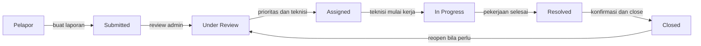
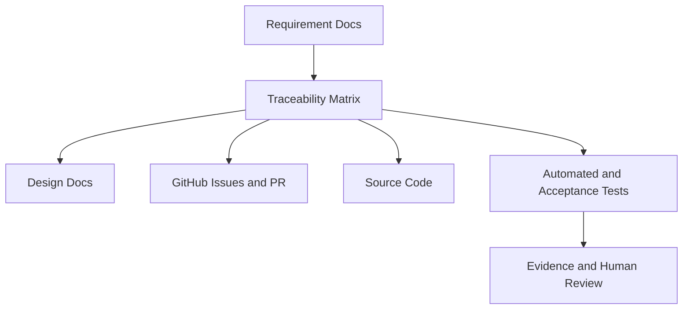
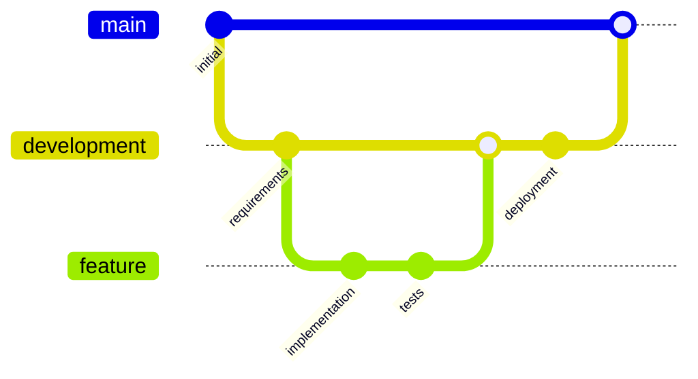

# Campus Service Request and Maintenance System

[](https://github.com/Prayerr10/Project-Final-SoftwareEngineering-/actions/workflows/ci.yml)
[](https://campus-maintenance.pkaawoan24.workers.dev)
[](./database/migrations)
[](./tests)
[](./CASE.md)

Sistem pelaporan dan pemeliharaan fasilitas kampus berbasis React, TypeScript, Cloudflare Workers, dan Cloudflare D1. Proyek ini dibuat sebagai tugas akhir mata kuliah Software Engineering dengan fokus pada requirement engineering, traceability, AI-assisted workflow, automated testing, acceptance testing, dan deployment Cloudflare.

> Production: [campus-maintenance.pkaawoan24.workers.dev](https://campus-maintenance.pkaawoan24.workers.dev)<br>
> Health check: [/api/health](https://campus-maintenance.pkaawoan24.workers.dev/api/health)<br>
> Branch pengembangan: `development`<br>
> Branch final submission: `main` setelah merge final dari `development`

## Gambaran Sistem

Campus Service Request and Maintenance System membantu civitas kampus membuat laporan kerusakan fasilitas, lalu memprosesnya melalui Administrator, Teknisi, dan Manajer Fasilitas sampai laporan selesai dan ditutup.



## Sorotan Fitur

| Area | Fitur |
| --- | --- |
| Pelaporan | Buat laporan, lihat daftar laporan, cari/filter, lihat detail laporan. |
| Review Admin | Review laporan, klasifikasi kategori, tentukan prioritas, assign Teknisi. |
| Pengerjaan Teknisi | Lihat tugas, terima tugas, ubah status kerja, tandai resolved. |
| Kolaborasi | Komentar publik, catatan internal, riwayat status otomatis. |
| Kontrol Akhir | Close laporan, reopen laporan, konfirmasi resolved oleh Pelapor. |
| Monitoring | Dashboard ringkas untuk status laporan dan beban kerja Teknisi. |

## Aktor

| Aktor | Peran Utama |
| --- | --- |
| Pelapor | Membuat dan memantau laporan layanan fasilitas kampus. |
| Administrator | Memvalidasi laporan, menentukan prioritas, dan menugaskan Teknisi. |
| Teknisi | Menangani pekerjaan lapangan dan memperbarui status pekerjaan. |
| Manajer Fasilitas | Melihat ringkasan operasional dan beban kerja. |

## Stack Teknologi

| Layer | Teknologi | Lokasi |
| --- | --- | --- |
| Frontend | React, TypeScript, Vite | [`src/`](./src) |
| Backend/API | Cloudflare Workers | [`worker/`](./worker) |
| Database | Cloudflare D1, SQLite migration | [`database/migrations/`](./database/migrations) |
| Testing | Vitest | [`tests/`](./tests) |
| CI | GitHub Actions | [`.github/workflows/`](./.github/workflows) |
| Deployment | Wrangler | [`wrangler.jsonc`](./wrangler.jsonc) |

## Struktur Repository

```text
.
|-- README.md
|-- CASE.md
|-- skills/
|   |-- 01-inception-stakeholder/SKILL.md
|   |-- 02-elicitation/SKILL.md
|   |-- 03-specification/SKILL.md
|   |-- 04-prioritization/SKILL.md
|   |-- 05-validation-change/SKILL.md
|   |-- 06-architecture-design/SKILL.md
|   |-- 07-database-api-design/SKILL.md
|   |-- 08-ui-design/SKILL.md
|   |-- 09-issue-planning/SKILL.md
|   |-- 10-implementation/SKILL.md
|   |-- 11-code-review/SKILL.md
|   |-- 12-test-planning/SKILL.md
|   |-- 13-automated-testing/SKILL.md
|   |-- 14-acceptance-testing/SKILL.md
|   `-- 15-deployment/SKILL.md
|-- docs/
|   |-- requirements/
|   |-- design/
|   |-- testing/
|   `-- deployment/
|-- src/
|-- worker/
|-- database/
|   `-- migrations/
|-- tests/
|   |-- unit/
|   |-- integration/
|   `-- acceptance/
|-- evidence/
|-- .github/
`-- wrangler.jsonc
```

## Requirement dan Traceability

| Artefak | Jumlah |
| --- | ---: |
| Functional Requirements | 24 |
| Non-Functional Requirements | 9 |
| Business Rules | 12 |
| User Stories | 17 |
| Acceptance Criteria | 40 |
| Change Request | 1 |
| Automated Tests | 81 passing |

Dokumen utama:

- [`docs/requirements/requirements.md`](./docs/requirements/requirements.md)
- [`docs/requirements/user-stories.md`](./docs/requirements/user-stories.md)
- [`docs/requirements/prioritization.md`](./docs/requirements/prioritization.md)
- [`docs/requirements/validation.md`](./docs/requirements/validation.md)
- [`docs/requirements/change-request.md`](./docs/requirements/change-request.md)
- [`docs/requirements/traceability.md`](./docs/requirements/traceability.md)
- [`docs/design/architecture.md`](./docs/design/architecture.md)
- [`docs/design/database-api.md`](./docs/design/database-api.md)
- [`docs/design/ui-flow.md`](./docs/design/ui-flow.md)



## API Utama

| Method | Endpoint | Fungsi |
| --- | --- | --- |
| GET | `/api/health` | Health check API dan D1. |
| GET | `/api/requests` | List, search, dan filter laporan. |
| POST | `/api/requests` | Membuat laporan baru. |
| GET | `/api/requests/:id` | Detail laporan, riwayat status, komentar, dan catatan sesuai role. |
| GET | `/api/technicians` | Daftar Teknisi aktif untuk Administrator. |
| GET | `/api/technicians/:id/tasks` | Daftar tugas Teknisi. |
| PATCH | `/api/requests/:id/review` | Review laporan oleh Administrator. |
| PATCH | `/api/requests/:id/classification` | Menentukan kategori dan prioritas. |
| PATCH | `/api/requests/:id/assignment` | Menugaskan Teknisi. |
| PATCH | `/api/requests/:id/accept` | Teknisi menerima tugas. |
| PATCH | `/api/requests/:id/progress` | Mengubah status ke `IN_PROGRESS`. |
| PATCH | `/api/requests/:id/resolve` | Mengubah status ke `RESOLVED`. |
| POST | `/api/requests/:id/comments` | Menambahkan komentar publik. |
| POST | `/api/requests/:id/internal-notes` | Menambahkan catatan internal. |
| PATCH | `/api/requests/:id/confirm-resolution` | Pelapor mengonfirmasi pekerjaan resolved. |
| PATCH | `/api/requests/:id/close` | Administrator menutup laporan. |
| PATCH | `/api/requests/:id/reopen` | Administrator membuka kembali laporan. |
| GET | `/api/dashboard/summary` | Dashboard operasional. |

## Cara Menjalankan Lokal

Prasyarat:

- Node.js 22 atau lebih baru.
- npm.
- Akun Cloudflare untuk deployment.

Install dependency:

```bash
npm ci
```

Jalankan development server:

```bash
npm run dev
```

Jalankan test:

```bash
npm test -- --run
```

Build production:

```bash
npm run build
```

Deploy ke Cloudflare:

```bash
npm run deploy
```

## Database

Migration D1 berada di [`database/migrations/`](./database/migrations):

- `0001_initial.sql`
- `0002_create_request_identity_and_history.sql`
- `0003_create_technicians_and_assignments.sql`
- `0004_create_request_comments_and_internal_notes.sql`
- `0005_create_reporter_confirmations.sql`
- `0006_enforce_request_status_priority.sql`

Binding D1 di [`wrangler.jsonc`](./wrangler.jsonc):

```jsonc
"d1_databases": [
  {
    "binding": "DB",
    "database_name": "campus-maintenance-db"
  }
]
```

## Testing dan CI

Test suite menggunakan Vitest dan dibagi menjadi:

- [`tests/unit/`](./tests/unit)
- [`tests/integration/`](./tests/integration)
- [`tests/acceptance/`](./tests/acceptance)

CI GitHub Actions menjalankan:

```bash
npm ci
npm test -- --run
npm run build
```

Workflow CI berjalan pada pull request, push ke `development`, dan push ke `main`.

## Catatan Penggunaan AI dan Skill

Pada tahap awal pengembangan, proyek ini menggunakan bantuan skill umum dari Matt Pocock dan beberapa skill awal buatan sendiri untuk mendukung perencanaan, implementasi, dan review. Menjelang finalisasi submission, folder [`skills/`](./skills) dirapikan ulang menjadi 15 `SKILL.md` sesuai template dosen agar seluruh proses Software Engineering terdokumentasi secara konsisten.

Skill 01-15 pada repository ini berfungsi sebagai dokumentasi final dan reusable process dari aktivitas yang sudah dilakukan melalui requirement, issue, pull request, implementasi, testing, deployment, dan human review. Commit finalisasi skill dibuat di akhir sebagai tahap audit dan standardisasi dokumentasi, bukan karena proyek dibuat ulang dari nol.

AI digunakan sebagai asisten kerja, bukan pengganti keputusan manusia. Bukti penggunaan AI disimpan di:

- [`skills/`](./skills)
- [`evidence/`](./evidence)
- [`docs/templates/human-review-template.md`](./docs/templates/human-review-template.md)
- Pull request body GitHub
- Human Review documents

Setiap work product penting mencatat:

- Prompt yang dipakai.
- Output awal AI.
- Kesalahan yang ditemukan.
- Revisi manusia.
- Hasil final.
- Keputusan human review.

## Branch dan Pull Request Workflow



Workflow yang digunakan:

1. Requirement dan design dibuat melalui branch feature.
2. Implementasi dikerjakan melalui issue-based branch.
3. Pull request dibuat ke `development`.
4. CI menjalankan test dan build otomatis.
5. Human review dicatat di PR dan folder `evidence/`.
6. Setelah semua gap selesai, `development` dapat di-merge ke `main` untuk final submission.

## Checklist Submit

- [x] URL Cloudflare aktif tersedia di README.
- [x] Health check `/api/health` tersedia.
- [x] Folder `skills/` berisi 15 `SKILL.md`.
- [x] Requirement, design, testing, deployment, dan evidence terdokumentasi.
- [x] `npm test -- --run` PASS.
- [x] `npm run build` PASS.
- [x] CI terakhir pada `development` PASS.
- [x] Tidak ada secret, token, password, atau API key production yang sengaja disimpan di repository.
- [ ] Merge final `development` ke `main` dilakukan setelah seluruh instruksi dosen dianggap final.

## Konteks Akademik

Repository ini dibuat untuk kebutuhan akademik mata kuliah Software Engineering oleh Prayer Yosua Immanuel Kaawoan. Semua data dummy yang dipakai pada testing dan deployment smoke test tidak berisi data pribadi atau credential production.
